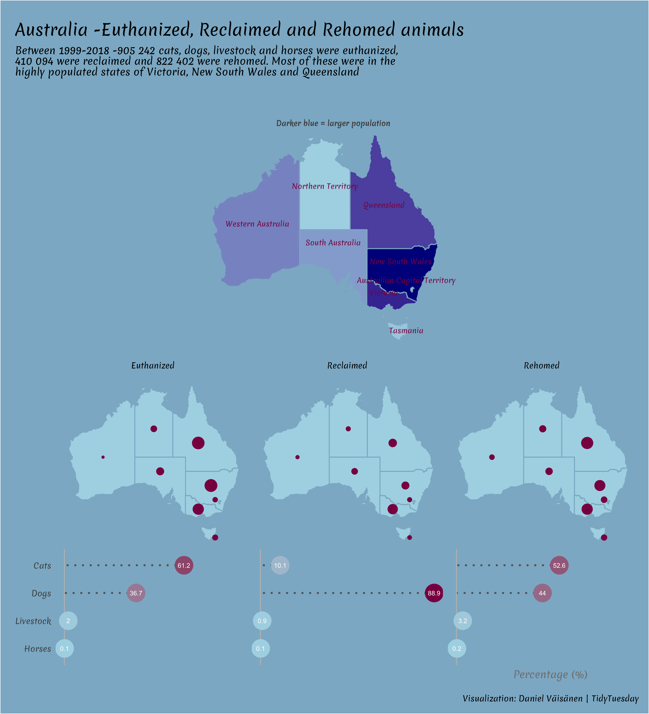

<!-- README.md is generated from README.Rmd. Please edit that file -->

`{r setup, include = FALSE} knitr::opts_chunk$set( collapse = TRUE,
comment = "#>" )`

# tidytuesday 

## 2020-07-23 `r emo::ji("smiley_cat")`

